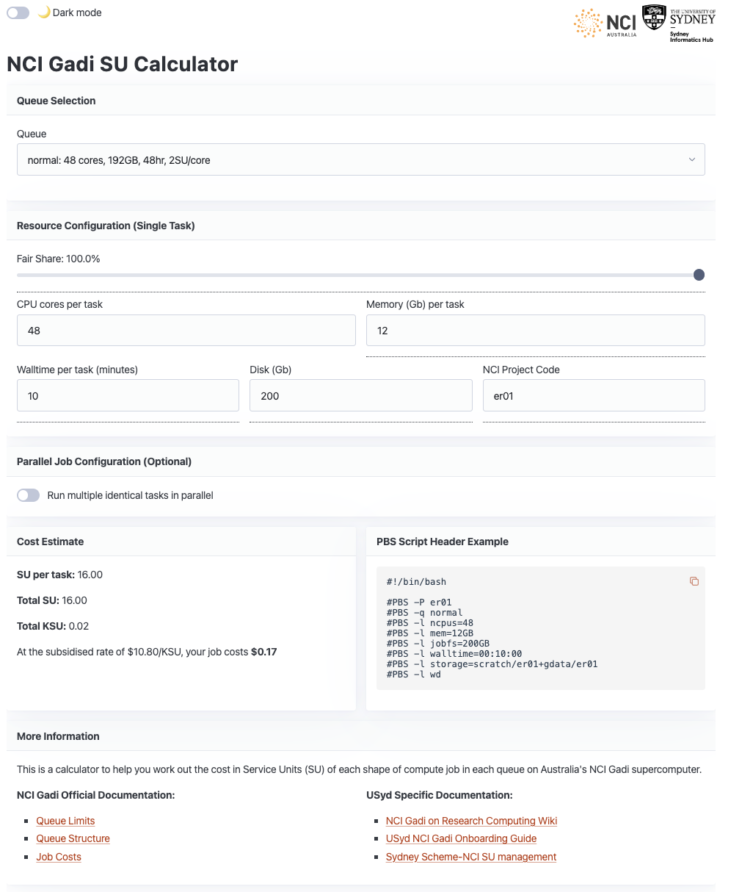

# nci-su-calculator

Service unit calculator for the NCI Gadi HPC. 

Try an [example with 6 cores, 24Gb, 2hr walltime in project ab12](https://sydney-informatics-hub.github.io/nci-su-calculator/?queue=normal&cpus=6&mem=24&walltime=2&project=ab12)

Inspired by the Pawsey counterpart, developed by our friend Sarah Beecroft: https://pawseysc.github.io/su-calculator/
