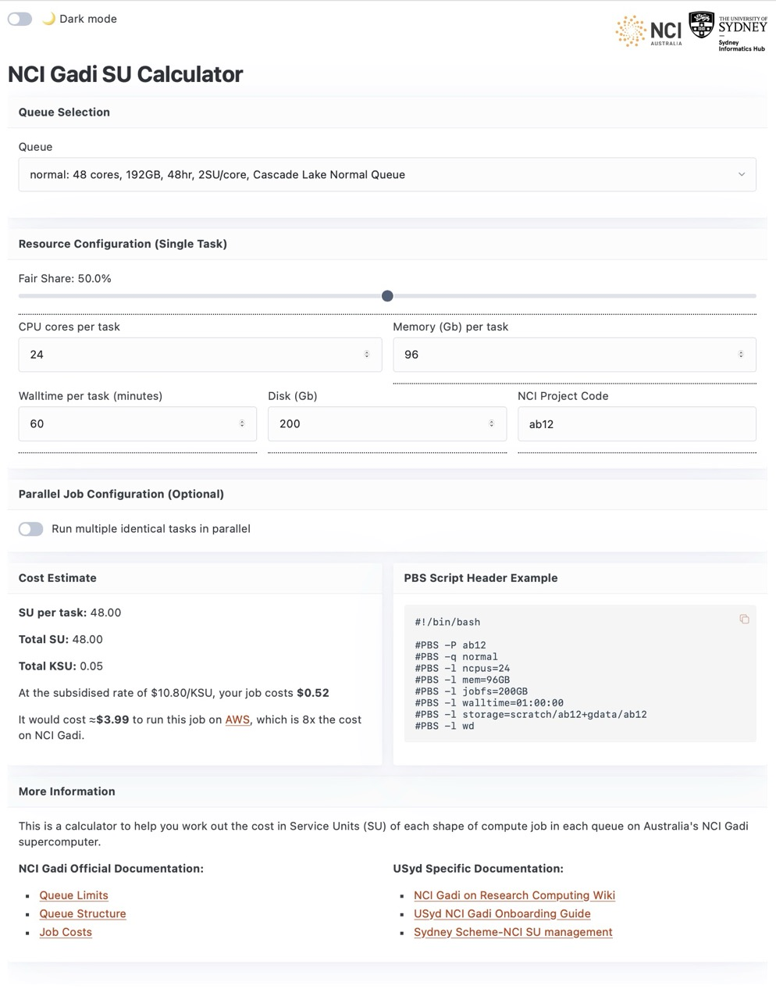

# nci-su-calculator

Service unit calculator for the NCI Gadi HPC. 

Try an [example with 24 cores, 96Gb, 1hr walltime in project ab12](https://sydney-informatics-hub.github.io/nci-su-calculator/?queue=normal&cpus=24&mem=96&walltime=60&fairshare=50&project=ab12&disk=200)

Inspired by the Pawsey counterpart, developed by our friend Sarah Beecroft: https://pawseysc.github.io/su-calculator/
